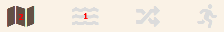
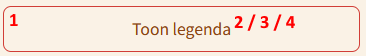

# Technische beschrijving

Deze pagina biedt een overzicht van de op te maken componenten binnen een thema.

## Inhoud

- [Algemeen](#algemeen)
- [Lettertypes](#lettertypes)
- [Hoofdelementen](#hoofdelementen)
- [Hero](#hero)
- [Titelbalk](#titelbalk)
- [Verhaalnavigatie](#verhaalnavigatie)
- [Paragraafscheiding](#paragraafscheiding)
- [Afbeeldingen](#afbeeldingen)
- [Actieknop](#actieknop)
- [Credits](#credits)
- [Tabbladen](#tabbladen)
- [Paneel](#paneel)
- [Footer](#footer)

## Componenten

### Algemeen

#### Omschrijving
Algemene, thema-brede kleuren: [gebruikt kleurenpalet](https://coolors.co/faf2e6-8b4513-bb9d93-230c0f-393e41)

##### Variabelen

1. --theme-background-color
2. --theme-color
3. --theme-color-accent
4. --theme-credits-panel-color
5. --theme-text-color

[Terug naar inhoudsopgave](#inhoud)

 

### Lettertypes

#### Omschrijving
De gebruikte lettertypes binnen het thema.

##### Variabelen

1. --theme-h1-color
2. --theme-h1-font-family
3. --theme-h1-font-size
4. --theme-h1-font-weight
5. --theme-h2-color
6. --theme-h2-font-family
7. --theme-h2-font-size
8. --theme-h2-font-weight
9. --theme-primary-font-family
10. --theme-primary-font-size
11. --theme-primary-font-weight

[Terug naar inhoudsopgave](#inhoud)

 

### Hoofdelementen

#### Omschrijving
`Blockquote`, `p`, `selection`, `splitter`, etc.

##### Variabelen

1. --theme-blockquote-border-color
2. --theme-blockquote-color
3. --theme-blockquote-font-family
4. --theme-blockquote-font-size
5. --theme-blockquote-font-weight
6. --theme-inv-light-background-color
7. --theme-lightbox-background-color
8. --theme-p-color
9. --theme-p-font-family
10. --theme-p-font-size
11. --theme-p-font-weight
12. --theme-p-line-height
13. --theme-p-a-border-bottom-color
14. --theme-p-a-color
15. --theme-p-a-font-family
16. --theme-p-a-font-size
17. --theme-p-a-font-weight
18. --theme-p-a-color-hover
19. --theme-selection-background-color
20. --theme-selection-color
21. --theme-separator-color
22. --theme-sidecar-viewing-background-color
23. --theme-splitter-background

[Terug naar inhoudsopgave](#inhoud)

 

### Hero

#### Omschrijving
Meta-data op de hero-image.

##### Variabelen

1. --theme-hero-divider-color
2. --theme-hero-meta-data-color

[Terug naar inhoudsopgave](#inhoud)

 

### Titelbalk

#### Omschrijving
Elementen in de titelbalk.

##### Variabelen

1. --theme-nav-bar-shrink-background-color
2. --theme-nav-bar-shrink-bo-logo-color-black
3. --theme-nav-bar-link-color
4. --theme-nav-bar-li-color
5. --theme-nav-bar-li-font-family
6. --theme-nav-bar-li-font-size
7. --theme-nav-bar-li-font-weight
8. --theme-bo-logo-color-black

[Terug naar inhoudsopgave](#inhoud)

 

### Verhaalnavigatie

#### Omschrijving
Hyperlinks naar verhaalonderdelen.

##### Variabelen

1. --theme-navigation-viewer-background-color
2. --theme-navigation-viewer-border-bottom
3. --theme-navigation-bar-button-color
4. --theme-navigation-bar-button-font-family
5. --theme-navigation-bar-button-font-size
6. --theme-navigation-bar-button-font-weight
7. --theme-navigation-bar-button-border-bottom-color-hover
8. --theme-navigation-bar-button-border-bottom-color-active
9. --theme-arrow-color
10. --theme-arrow-color-hover
11. --theme-arrow-left-background-image
12. --theme-arrow-right-background-image

[Terug naar inhoudsopgave](#inhoud)

 

### Paragraafscheiding

#### Omschrijving
Elementen als paragraafscheiding.

##### Variabelen

1. --theme-index-li-color
2. --theme-index-li-color-hot

[Terug naar inhoudsopgave](#inhoud)

 

### Afbeeldingen

#### Omschrijving
Mogelijkheid tot opmaken van de carousel-knoppen en hyperlinks in het onderschrift (geldt niet voor het onderschrift in een featherlight box. Tekstkleur van het onderschrift is de `--theme-color`. 

##### Variabelen

1. --theme-image-attribution-link-color 
2. --theme-image-carousel-button-color

[Terug naar inhoudsopgave](#inhoud)

 

### Actieknop

#### Omschrijving
Actieknop in de lopende tekst van een sidecar. De achtergrond is transparent (tenzij `hot`), dus deze is impliciet gelijk aan `--theme-background-color`.

##### Variabelen

1. --theme-main-button-box-shadow
2. --theme-main-button-font-size
3. --theme-main-button-text-color
4. --theme-main-button-text-font-family
5. --theme-main-button-hot-background-color
6. --theme-main-button-hot-button-text-color

[Terug naar inhoudsopgave](#inhoud)

 

### Credits

#### Omschrijving
Afsluitende credits-sectie.

##### Variabelen

1. --theme-credits-h3-color
2. --theme-credits-h3-font-family
3. --theme-credits-h3-font-size
4. --theme-credits-p-color
5. --theme-credits-p-font-size
6. --theme-credits-p-font-weight
7. --theme-credits-separator-color

[Terug naar inhoudsopgave](#inhoud)

 

### Tabbladen

#### Omschrijving
Tabbladen (`card`) zoals op de wandelinfo-pagina.

##### Variabelen

1. --theme-card-background-color
2. --theme-card-background-color-inactive
3. --theme-card-border-color
4. --theme-card-box-shadow
5. --theme-card-header-color
6. --theme-card-header-font-family
7. --theme-card-header-font-size
8. --theme-card-header-font-weight
9. --theme-card-p-font-size
10. --theme-card-p-a-font-size

[Terug naar inhoudsopgave](#inhoud)

 

### Paneel

#### Omschrijving
Rijke hyperlink (mini-paragraaf) met korte tekst en illustratie.

##### Variabelen

1. --theme-panel-background-color
2. --theme-panel-background-color-hover
3. --theme-panel-h4-color
4. --theme-panel-h4-font-family
5. --theme-panel-a-border-bottom-color
6. --theme-panel-a-color
7. --theme-panel-a-font-family
8. --theme-panel-p-color
9. --theme-panel-p-line-height

[Terug naar inhoudsopgave](#inhoud)

 

### Footer

#### Omschrijving
De footer wordt niet in het thema opgemaakt, alleen de pre-footer (een extra balk voor de eigenlijke footer).

##### Variabelen

1. --theme-pre-footer-background-color

[Terug naar inhoudsopgave](#inhoud)

 
